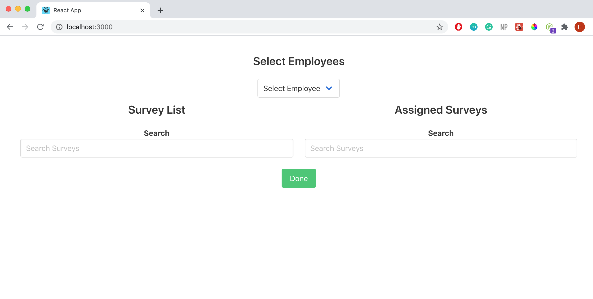

# REACT-REDUX-NODE APP

This is a basic react redux app with node and express backend. This app shows what surveys are asigned to each employee and what surveys can be assigned.

## Run the App

### `npm run dev`

You can start the app from the root folder by entering command ***npm run dev***
.  Both node app and react app will run concurrently so you don't have to open two  terminals to run both backend and frontend.

   

Open [http://localhost:3000](http://localhost:3000) to view it in the browser.

## Actions

### `Selet Employee`

You can select an employee from the dropdown menu.

After selecting the employee you will see the employee window

